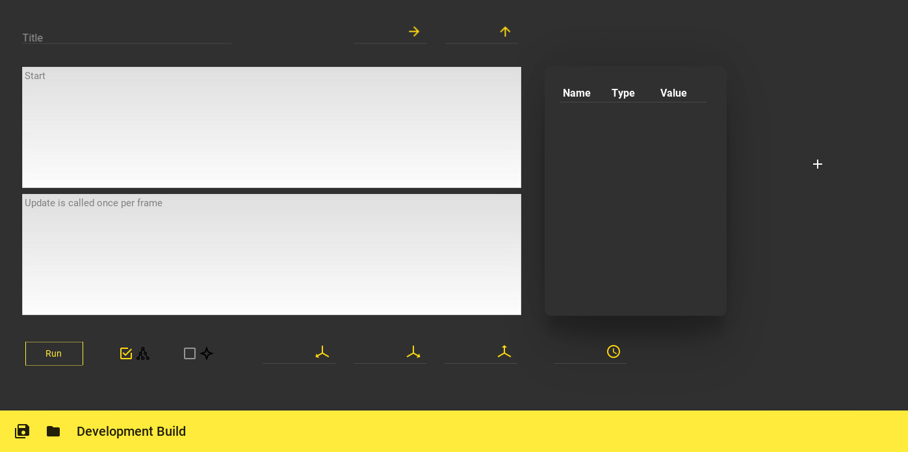
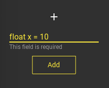
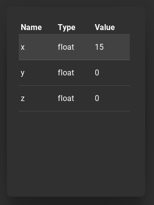
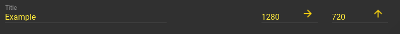
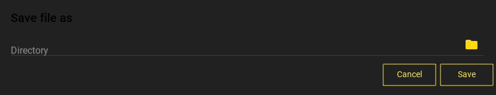
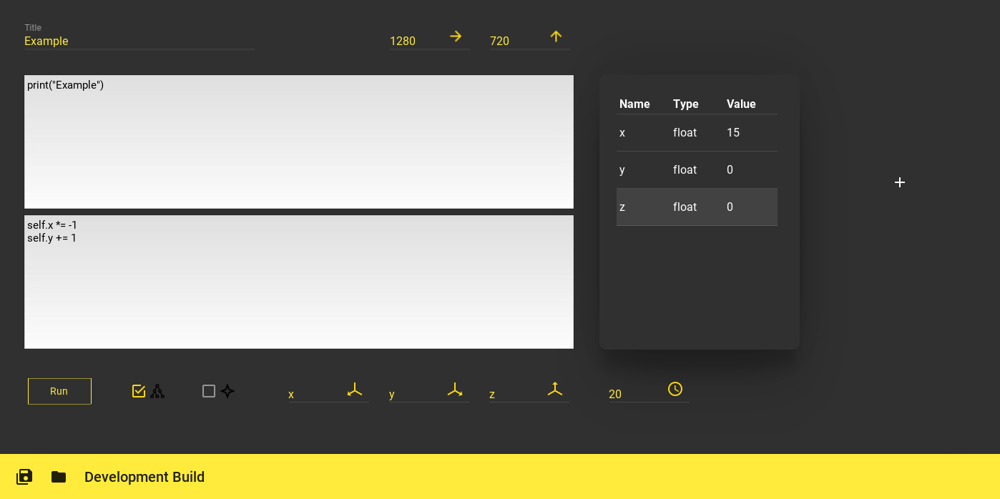
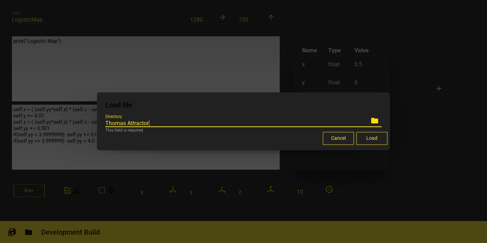
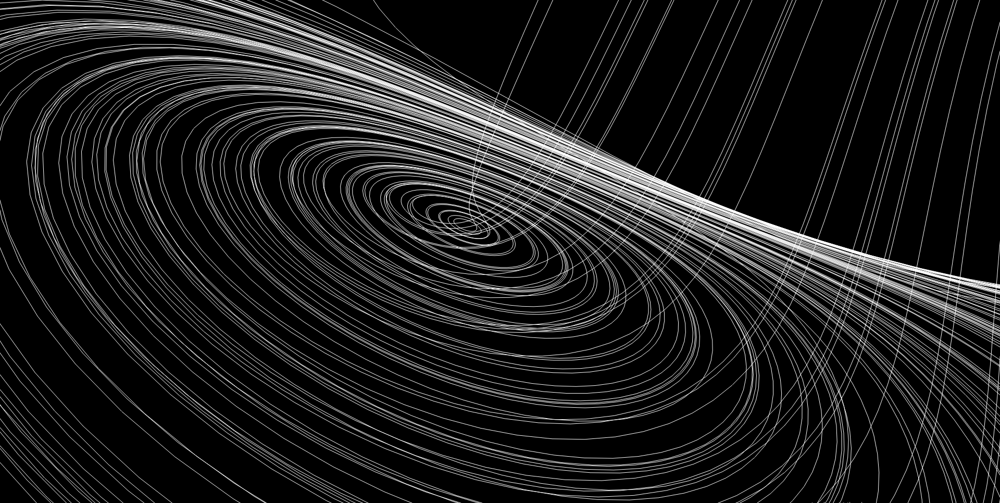
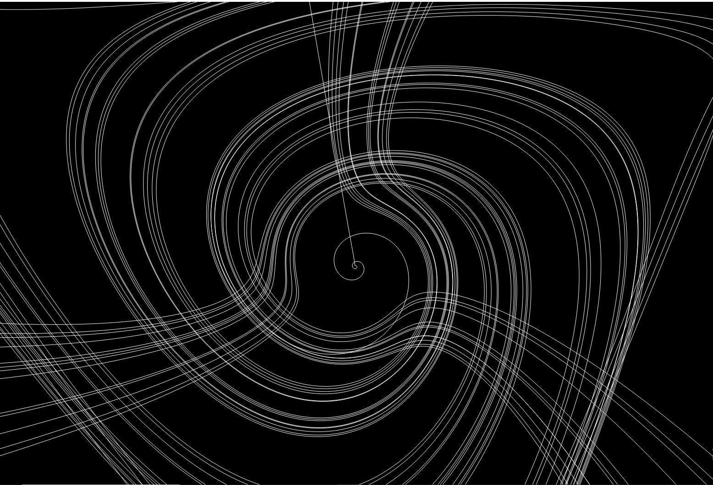

# Equation Engine
Why this? This can be useful on many fields: you can use it to verify or make some physics experiments, with almost no coding knowlege. PyQtGraph (the module that made this repository possible) was born for scientific visualization, and I wanted to do something which does the same job, in an easier way.

## Setup
Let's begin with cloning this repository:
```git clone https://github.com/MrSinho/Algorithm_Engine```

open the terminal with the virtual environment, and type 
```python
pip install kivy kivymd pyopengl numpy pyqtgraph
```
Now run the ```main.py```, you'll see something like this: 



## Overview
In the ```Start``` function you have to write some basic code which will run just at the beginning of the script, the ```Update``` function runs/is updated every time your machine makes a new frame. On the left you have the ```variables``` data table, which contains the variables you're going to use. If you click the plus icon, you can add, rename, and change the type and value of a variable. 
Example: 
- We want to add a variable ```var```, we need to give the ```type``` ```name``` and ```initial value```: ```int var = 1```
- Now let's rename it to k: ```rename var x```
- We also need to change the value to float: ```type x float```
- The initial value is too small, we want something bigger: ```value x 15```



Let's write our first equation: first, we need to add more variables, click on the ```plus``` icon, and write ```float y = 1```, ```float z = 0```.



In the ```Start``` function we'll print the name of the equation, just for fun: ```print("Example")```. 
In the ```Update``` function we'll make x becomes first negative, then positive, and so on... ```self.x *= -1```, and y will slowly increase by 1 ```self.y += 1``` So this is the final result:
```python
self.x *= -1
self.y += 1
```
We have to specify which variables will represent which axis: for now the ```x``` will represent the ```x axis```, the ```y``` for the ```y axis``` and the ```z``` for the ```z axis```.


You'll also notice an input field with a clock icon on the right: this represents the update delay in milliseconds, which means how fast will the code update. We'll give an input of ```20``` milliseconds.


We also have to choose what to see in the three-dimensional graph: some lines, or some dots? Let's select the first option for drawing lines. Note: the dots option is not fully optimized.


If you go up you'll see there are some more required field: the one on the upper left corner is the title of what we're doing, I'll type ```Example``` inside. On the right, the other ones tell the default width and height of the window with the 3d environment. Let's make a width of ```1280``` pixels and a height of ```720``` pixels.



Before running, let's save all what we've done: click on the save icon of the toolbar (down left corner), then give a name to the code:



Now execute the code by clicking the ```Run``` button.



This is the final result:


## Load some examples
You can load (by clicking the folder icon on the toolbar) more examples, such as the ```Lorenz Attractor```, the ```Thomas Attractor```, and the ```Logistic Map```, which are on this repository by default. You can also write, save, and load your equations.








Made by [Sinho Graphics](https://www.instagram.com/sinho_graphics)
